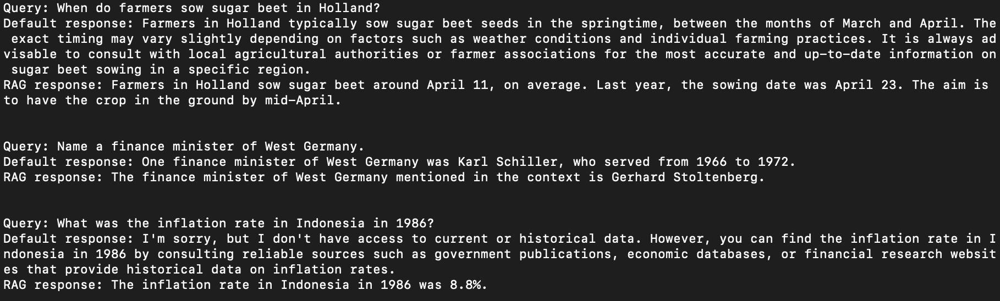

# rag-model

This repo shows a fairly minimal working [Retrieval Augmented Generation (RAG) model](https://www.ianxmason.com/posts/RAG/).

This example embeds ~100 documents from the [nltk reuters](https://www.nltk.org/book/ch02.html) corpus and uses them to
provide additional information to ChatGPT.

## Requirements & Set-UP
### Requirements
In `misc` there is a `requirements.txt`. From `misc/` run:
```
pip3 install -r requirements.txt
```
I am not sure if it is a complete set of requirements or not as I already had a lot of stuff installed

### Set-Up
In credentials.json replace "your-key-here" with your open ai api key. Take care not to push it to github.

### External Tools
- [Open AI Api](https://platform.openai.com/docs/guides/embeddings)
- [ChromaDB](https://docs.trychroma.com) is an open source VectorDB that allows for easy persistent local storage (making it good for early tests.) More complex offerings include Postgres, Weaviate & MyScale.
    - Source code for the embedding function used to create the VectorDB is [here](https://github.com/chroma-core/chroma/blob/019b954e571fe362a420ec27b2add9bac94c6334/chromadb/utils/embedding_functions.py#L69)

# Running the Model
### One-Time VectorDB Creation
Create the VectorDB with `src/embedder.py`. You will likely need to set `nltk_download=True` to get the data which will store by default in `~/nltk_data`. From `src/` run:
```
python embedder.py
``````

### Running the RAG model
The rag model takes a user query and finds the closest three documents in the VectorDB. The query and documents are then provided
to gpt to generate an answer using the additional information from the documents. From `src/` run:
```
python rag.py
```

### Exemplar output
Here we see the output of running `rag.py`. Note how the context from the VectorDB changes the answers. In the last example GPT refuses to answer factual questions without additional context.




